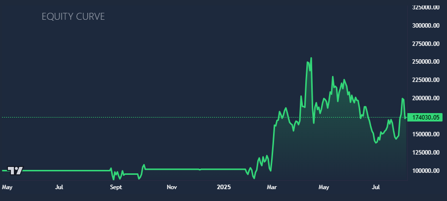
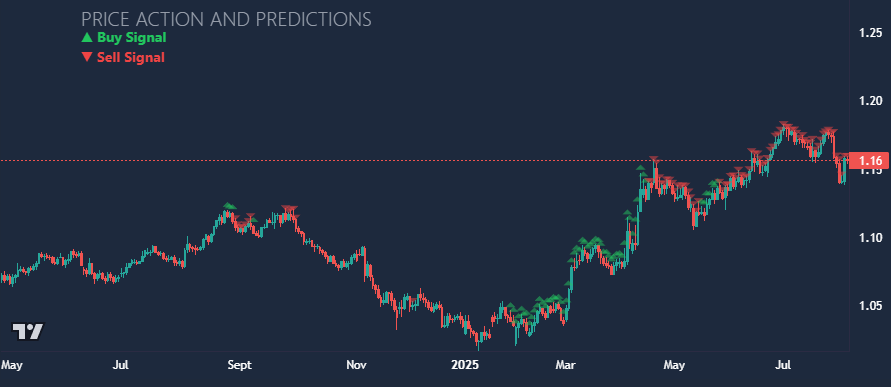

This project implements an ensemble of LSTM models to predict forex market direction using both technical indicators and macroeconomic data. Predictions are integrated into a simulated trading strategy with a dashboard for visualisation.

# Demo
[Live Dashboard](http://forex-model-frontend.s3-website.eu-west-2.amazonaws.com/)

If you prefer to run locally, follow the installation steps below.

# Features
### Ensemble Architecture
- Macroeconomic and technical indicator LSTMs
- Three class decision logic inspired by academic research (Yıldırım, D.C., Toroslu, I.H. & Fiore, U. Forecasting directional movement of Forex data using LSTM with technical and macroeconomic indicators. Financ Innov 7, 1 (2021))

### Trading Simulator
- Backtests predictions over historical data
- Produces metrics for strategy evaluation

### Interactive Dashboard
- Candlestick chart with markers for model predictions
- Equity curve
- Display of metrics
- Settings including starting cash, leverage, lot size and date range
- Built with React + FastAPI backend

### Deployment
- Hosted on AWS (S3 + Elastic Beanstalk)
- FastAPI for running model

# Results
In 9 trades from April 25, 2024 - August 4, 2025 (Leverage: 10, Lot size: 8, Start cash: $100,000):
- Total Returns: 72.75%
- Win Rate: 55.56%
- Max Drawdown: 45.8%
- Profit Factor: 14.5






# Tech Stack
- Machine Learning: TensorFlow, Sckit-Learn
- Data Sources: Alpha Vantage, The Wall Street Journal, Federal Reserve Bank of St. Louis, European Central Bank
- Frontend: React, Tailwind CSS
- Backend: Python, FastAPI
- Deployment: AWS S3, AWS Elastic Beanstalk, Docker

# Setting up
### 1. Clone the repo
```bash
git clone https://github.com/ChizobaNkamuo/Forex-ML-Strategy-Simulator.git
cd Forex-ML-Strategy-Simulator
```

### 2. Run backend
```bash
cd backend
pip install -r requirements.txt
uvicorn main:app --reload
```

### 3. Run frontend
```bash
cd frontend
npm install
npm start
```

# ⚠️ Note on data
The datasets are not included in this repository. You will need to download the required data from the listed sources and format it as follows:

Files should be named:
```
Fed_Funds_Rate.csv  
USA_CPI.csv  
EU_HICP.csv  
DAX_Close.csv  
EU_Interest.csv  
German_Interest.csv  
SP500.csv  
```


Each file must include a date column, and the primary data column should match the filename (e.g., Fed_Funds_Rate for Fed_Funds_Rate.csv) and should be placed in `backend/data`.

This ensures compatibility with the preprocessing and model training pipeline.